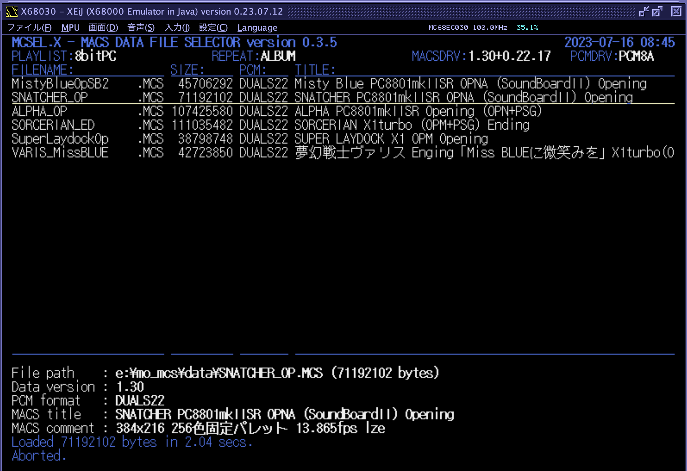
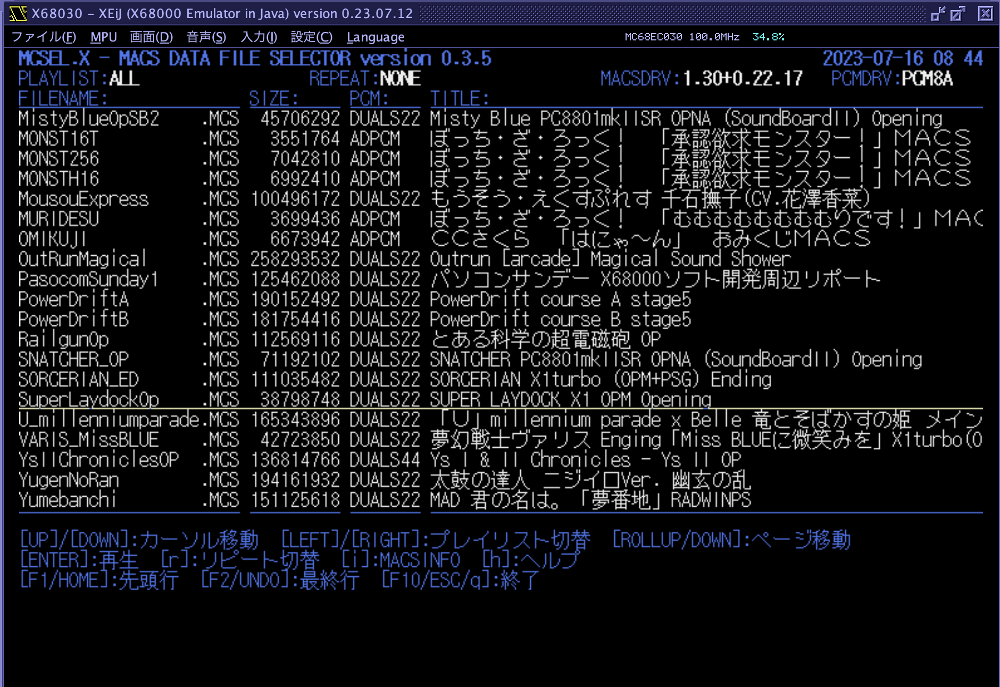

# MCSEL.X

MACS Data File Selector for Human68k/X680x0

---

## About This

MACSデータファイルのセレクタ兼ローダです。「まくせる」と読みます（ぉ

 - ハイメモリ専用
 - ディスクからハイメモリに高速ダイレクトロード
 - PhantomX VDISK対応
 - エミュレータのホストファイルシステム対応
 - プレイリスト対応
 - リピート再生対応

---

## 動作環境

PhantomX + ハイメモリ + VDISK、または エミュレータ + ハイメモリ + ホストファイルシステムを想定しています。
ハイメモリは必須となります。SASI/SCSIディスクは読み込み速度の点で非推奨になります。

---

#### ハイメモリ

060turbo方式のハイメモリ(最低128MB程度、できれば384MB以上)が必須となりますので、以下のいずれかのハイメモリドライバが必要です。

1. 060turbo.sys

68060の場合はOSに対するパッチ等の理由からこちらをお勧めします。拡張モード(`-xm`)である必要はありませんが、`-ss`と`-dv`はつけたほうが良いでしょう。

2. TS16DRVp.X

68030/68040の場合はこちらをお勧めします。特にオプションなどの指定はありません。

注意：ハイメモリドライバが組み込まれていない場合は起動エラーとなります。

注意：68000+ハイメモリの構成でも動作報告を頂いていますが、十分なテストを行なっているわけではありません。

---

#### PCMドライバ

PCMドライバとして、PCM8A.X (256MBハイメモリ対応版) または PCM8PP.X が必須です。
いずれも組み込まれていない場合は起動エラーとなります。(`-f`オプションをつけるとチェックをスキップできます)

PCM8A.X の256MBハイメモリ対応改造版は以下のTcbnErik氏のGithubから入手できます。

[PCM8A.X 改造版](https://github.com/kg68k/pcm8a)

---

#### MACSドライバ

ハイメモリに対応した MACSDRV.X が組み込まれている必要があります。
また、必須ではありませんが MACSINFO.X をパスの通った場所に導入しておくことを推奨します。

---

#### IPL-ROM

384x256モードのMACSデータを再生するには IPL-ROM 1.6 が必要です。
1.5以下の場合は別途 CRTMOD16.X を`-e`オプション付きでMACSDRVの前に組み込んでください。

---

#### SCSIドライバ

速度の面であまりお勧めしませんが、どうしてもSCSIディスクから読み込みしたい場合はTS16FILE.X が必須になります。VDISK(PhantomX), HFS(XEiJ) の場合は必要ありません。Windrvは未確認です。

注意：TS16FILE.Xの後にSUSIE.XなどのSCSI関連デバイスドライバを組み込まないようにしてください。

---

## インストール

MCSELxxx.ZIP をダウンロードして、MCSEL.X をパスの通ったディレクトリにコピーします。

以下の2つの環境変数を設定しておきます。

- MCSEL_DATA_PATH ... MACSデータファイル(*.MCS)を格納してあるディレクトリ名をセミコロン(;)で区切って連結したもの。

- MCSEL_LIST_PATH ... MACSプレイリストファイル(*.MCL)を格納してあるディレクトリ名。1つだけ指定可能。

例：

    SET MCSEL_DATA_PATH=G:\MCS_DATA;H:\MCS_DATA;I:\MCS_DATA;J:\MCS_DATA;K:\MCS_DATA
    SET MCSEL_LIST_PATH=D:\MCS_LIST

#### MACSプレイリストファイル(*.MCL)

単にMCSファイルのフルパス名を1行に1つずつ記述したテキストファイルです。
作成の方法は2通りあります。

1. テキストエディタで作成

ファイル名がプレイリスト名として扱われます。

2. MCSEL上で作成

スペースキーでMCSファイルを選択し、`c`キーを押すと新規プレイリストを作成することができます。

再生順はファイルに記載した順となります。

---

## 利用方法

必要なドライバと環境変数を設定した上で、

    mcsel

で起動します。条件に不足があった場合は起動エラーとなりますのでメッセージを確認してください。

コマンドラインオプションもいくつかありますが、詳細は `-h` で表示されるヘルプを参照してください。

起動直後の画面は上記のようになります。

- 1行目 ... アプリケーションのバージョン、PhantomXの場合はSoC温度、日付と時刻
- 2行目 ... 現在選択されているプレイリスト名、現在のリピートモード、MACSDRVのバージョン、PCMドライバの種類
- 4行目以降 ... MCSファイルのリスト
- 下段部 ... 操作説明

起動直後はプレイリスト"ALL"となっています。これは`MCSEL_DATA_PATH`で指定したディレクトリ全体からスキャンしたすべてのMCSファイルがリストされます。
プレイリストはカーソルの左右で切り替えが可能です。

カーソルバーはカーソルキーの上下で動かせます。その他ページ送りやリスト先頭・末尾へのジャンプなどもありますのでヘルプメッセージを参照してください。
なお、ヘルプに書かれていませんが、emacsキーバインドおよびviキーバインドの一部も対応しています。

リターンキーを押すと選択されているMACSデータを再生します。ロード中に`SHIFT`キーを押しつづけるとキャンセル可能です。

---

`r`キーを押すとリピートモードを切り替えることができます。(詳細後述)

`i`キーを押すとmacsinfoの結果を下段部に表示します。行数の関係で一部見切れます。

`h`キーを押すと起動直後に表示されるものと同じ操作方法のヘルプを下段部に表示します。

`ESC`キー、`q`キー、F10キーのいずれかで終了します。

---

## リピート再生

`r`キーを押すたびに、リピートモードを切り替えることができます。
NONE -> ALBUM -> SHUFFLE -> SINGLE -> SINGLE2 -> SINGLE3 -> NONE -> ... と押すたびに切り替わります。

- NONE ... リピートしません。1回だけ再生します。(MACSデータ内部でループが設定されている場合はそれに従ってループします)

- ALBUM ... 再生終了後、リスト上の次のMCSデータを順番に1回ずつ再生します。リストの最後までいくと先頭に戻って繰り返します。

- SHUFFLE ... 再生終了後、リスト上のMCSデータをランダムに1回ずつ再生します。

- SINGLE ... 同一MCSを無限回リピートします。

- SINGLE2 ... 同一MCSを2回再生します。

- SINGLE3 ... 同一MCSを3回再生します。

いずれのモードであっても、`ESC`で再生キャンセルするか、`SHIFT`でロードキャンセルするとリピート動作を停止します。

---

## Raspberry Pi を使った16bitPCM外部同期再生

MCSEL.Xは `s44rasp` 及び `s44raspd` を使った16bitPCM外部同期再生に対応しています。
以下のような場合にメリットがあります。

- Mercury Unitを所有していないが、16bitPCM対応データを元の品質のまま再生したい場合
- Mercury Unitを所有しているが、フレームドロップ率を最小限にしたい場合(MACSDRVのPCMミュートモードを使って再生するためにフレーム落ちが改善します)

外部同期演奏を行う場合は、Raspberry Pi とX680x0本体をRS232C-USBクロスケーブルで接続した上で、Raspberry Pi側に以下のソフトウェアを導入する必要があります。

- [s44rasp](https://github.com/tantanGH/s44rasp/)
- [s44raspd](https://github.com/tantanGH/s44rasp-x68k/)

さらに、あらかじめ再生するものと同じ .mcs ファイルをラズパイ側に転送しておく必要があります。日本語ファイル名は利用できません。

例えば `hogehoge.mcs` を data/mcs/ 以下にコピーしておき、

        nohup s44raspd -d /dev/ttyUSB0 -o -a hw:2,0 data/mcs &

としてバックグラウンドで s44raspd を起動した状態で、RS232C - USB クロス接続した PhantomX 実機上から

        mcsel -p .

とすることで同期再生が可能です。ただし、一時停止など、再生開始とESCでのアボート以外の操作には対応していません。
また、タイミングには微妙にずれがあります。

---

## Special Thanks

以下のMACSプレーヤの仕様および実装を参考にさせて頂きました。この場を借りてお礼申し上げます。

- MACSplay.x (カタさん)
- MCSP.X (みゆ🌹ฅ^•ω•^ฅ さん)

その他挙げきれないほどの素晴らしいソフトウェア・ハードウェアにお世話になっています。ありがとうございます。

---

## 動作確認環境

以下でのみ動作確認しています。

- X68000XVI 実機 + PhantomX 1.02c (68030モード・ハイメモリ384MB・VDISK・4B) + Mercury Unit V3 + PCM8PP.X
- XEiJ (68060モード・ハイメモリ768MB・HFS) + 060turbo.sys + PCM8A.X
- XEiJ (68030モード・ハイメモリ128MB・HFS) + TS16DRVp.X + PCM8A.X

---

## History

* 0.3.9 (2023/07/21) ... プレイリスト作成に対応
* 0.3.8 (2023/07/20) ... 省電力モード対応(3分間操作しないと画面の輝度を落とします)
* 0.3.7 (2023/07/16) ... s44rasp 対応機能を有効化
* 0.3.6 (2023/07/16) ... 特殊環境用に -f オプション追加
* 0.3.5 (2023/07/16) ... 初版
