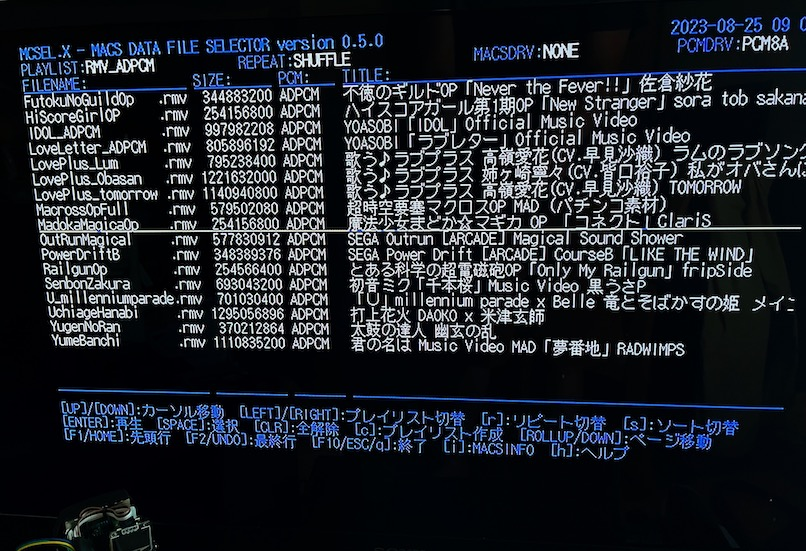

# MCSEL.X

MACS/VDT/V16/ISD/ISM/RMV Data File Selector for Human68k/X680x0

---

## About This

MACS/VDT/V16/ISD/ISM/RMV動画データファイルのセレクタ兼ローダです。

 - ディスクからハイメモリに高速ダイレクトロード
 - PhantomX VDISK対応
 - エミュレータのホストファイルシステム対応
 - プレイリスト対応
 - リピート再生対応
 - HVDTP.Xと組み合わせることでVDT/V16動画にも対応
 - HISDP.Xと組み合わせることでISD/ISM動画にも対応
 - RAWMVP.Xと組み合わせることでRAWMV動画(.RMV)にも対応

---

## 動作環境

MACS/VDT/V16/ISD/ISM再生の場合は PhantomX + ハイメモリ + VDISK、または エミュレータ + ハイメモリ + ホストファイルシステムを想定しています。
ハイメモリは必須となります。SASI/SCSIディスクは非対応です。

RMV再生の場合は X68000Z 1.3.1以降 + HDS または エミュレータ + ホストファイルシステムを想定しています。

注意点：
PhantomX を 68040/68060 モードで使用する場合、FLOAT4.X は組み込まないようにしてください。データのロード中にハングアップします。FLOAT4.Xは68040/68060には対応していません。

* 68040 ... FLOAT2.X を使用する
* 68060 ... 060turbo.sys を組み込み、FLOATは組み込まない

注意点:
PhantomX 68030/68040 モードで、060turbo.sys 0.59 を使ってハイメモリRAMDISKを確保する場合、`-ld`のRAMDISKオプション以外は指定しないようにしてください。大きいファイルのロードに失敗する可能性があります。

---

#### ハイメモリ (MACS/VDT/V16/ISD/ISM)

MACS/VDT/V16/ISD/ISM再生には060turbo方式のハイメモリが必須となりますので、以下のいずれかのハイメモリドライバが必要です。

1. 060turbo.sys

68060の場合はOSに対するパッチ等の理由からこちらをお勧めします。拡張モード(`-xm`)である必要はありませんが、`-ss`と`-dv`はつけたほうが良いでしょう。

2. TS16DRVp.X

68030/68040の場合はこちらをお勧めします。特にオプションなどの指定はありません。

注意：68000+ハイメモリの構成でも動作報告を頂いていますが、十分なテストを行なっているわけではありません。

---

#### ハイメモリ (RMV)

RMV再生の場合は16bitPCMデータを使う場合のみハイメモリが必要です。ADPCM音声・無音の場合はハイメモリは不要ですが、メインメモリにADPCMデータをすべて読み込むため、なるべく多くのメインメモリがあった方が良いです。

---

#### PCMドライバ

PCMドライバとして、PCM8A.X (256MBハイメモリ対応版) または PCM8PP.X が必須です。
いずれも組み込まれていない場合は起動エラーとなります。

PCM8A.X の256MBハイメモリ対応改造版は以下のTcbnErik氏のGithubから入手できます。

[PCM8A.X 改造版](https://github.com/kg68k/pcm8a)

---

#### MACSドライバ

MACS再生のためにはハイメモリに対応した MACSDRV.X (mod版) が組み込まれている必要があります。
組み込まれていない状態でMACS再生を行うとエラーになります。
また、必須ではありませんが MACSINFO.X をパスの通った場所に導入しておくことを推奨します。

---

#### RAWMVP.X

RAWMV形式動画の.RMVを再生するには [RAWMVP.X](https://github.com/tantanGH/rawmvp) の 0.6.0 以降が必要です。
パスの通ったディレクトリに導入しておいてください。

---

#### HVDTP.X

VDT/V16動画を再生するには [HVDTP.X](https://github.com/tantanGH/hvdtp) が必要です。
パスの通ったディレクトリに導入しておいてください。

---

#### HISDP.X

ISD/ISM動画を再生するには [HISDP.X](https://github.com/tantanGH/hisdp) が必要です。
パスの通ったディレクトリに導入しておいてください。

---

#### SCSIドライバ

速度の面であまりお勧めしませんが、どうしてもSCSIディスクからMACS/VDT/V16データを読み込みしたい場合はTS16FILE.X が必須になります。VDISK(PhantomX), HFS(XEiJ) の場合は必要ありません。

注意：TS16FILE.Xの後にSUSIE.XなどのSCSI関連デバイスドライバを組み込まないようにしてください。

---

## インストール

MCSELxxx.ZIP をダウンロードして、MCSEL.X をパスの通ったディレクトリにコピーします。

以下の2つの環境変数を設定しておきます。

- MCSEL_DATA_PATH ... MACS/VDT/V16/RMVデータファイルを格納してあるディレクトリ名をセミコロン(;)で区切って連結したもの。ディレクトリは再帰的にスキャンされます。

- MCSEL_LIST_PATH ... プレイリストファイル(*.MCL)を格納してあるディレクトリ名。1つだけ指定可能。ディレクトリの再帰スキャンは行いません。

例：

    SET MCSEL_DATA_PATH=G:\MCS_DATA;H:\MCS_DATA;I:\MCS_DATA;J:\MCS_DATA;K:\MCS_DATA
    SET MCSEL_LIST_PATH=D:\MCS_LIST

#### プレイリストファイル(*.MCL)

単にMCS/VDT/V16/RMVファイルのフルパス名を1行に1つずつ記述したテキストファイルです。
作成の方法は2通りあります。

1. テキストエディタで作成

ファイル名がプレイリスト名として扱われます。

2. MCSEL上で作成

スペースキーでMCSファイルを選択し、`c`キーを押すと新規プレイリストを作成することができます。

再生順はファイルに記載した順となります。

---

## 利用方法

必要なドライバと環境変数を設定した上で、

    mcsel

で起動します。条件に不足があった場合は起動エラーとなりますのでメッセージを確認してください。

コマンドラインオプションもいくつかありますが、詳細は `-h` で表示されるヘルプを参照してください。

起動直後の画面は上記のようになります。

- 1行目 ... アプリケーションのバージョン、PhantomXの場合はSoC温度、日付と時刻
- 2行目 ... 現在選択されているプレイリスト名、現在のリピートモード、MACSDRVのバージョン、PCMドライバの種類
- 4行目以降 ... MCS/VDT/V16/RMVファイルのリスト
- 下段部 ... 操作説明

起動直後はプレイリスト"ALL"となっています。これは`MCSEL_DATA_PATH`で指定したディレクトリ全体からスキャンしたすべてのMCSファイルがリストされます。
プレイリストはカーソルの左右で切り替えが可能です。

カーソルバーはカーソルキーの上下で動かせます。その他ページ送りやリスト先頭・末尾へのジャンプなどもありますのでヘルプメッセージを参照してください。
なお、ヘルプに書かれていませんが、emacsキーバインドおよびviキーバインドの一部も対応しています。

リターンキーを押すと選択されているMACSデータを再生します。ロード中に`SHIFT`キーを押しつづけるとキャンセル可能です。

---

`r`キーを押すとリピートモードを切り替えることができます。(詳細後述)

`s`キーを押すとソート順を切り替えることができます。

`i`キーを押すとmacsinfoの結果を下段部に表示します。行数の関係で一部見切れます。

`e`キーを押すとRMVファイルの場合はエディタED.Xを呼び出して内容の編集ができます。

`h`キーを押すと起動直後に表示されるものと同じ操作方法のヘルプを下段部に表示します。

`ESC`キー、`q`キー、F10キーで終了します。

---

## リピート再生

`r`キーを押すたびに、リピートモードを切り替えることができます。
NONE -> ALBUM -> SHUFFLE -> SINGLE -> SINGLE2 -> SINGLE3 -> NONE -> ... と押すたびに切り替わります。

- NONE ... リピートしません。1回だけ再生します。(MACSデータ内部でループが設定されている場合はそれに従ってループします)

- ALBUM ... 再生終了後、リスト上の次のMCSデータを順番に1回ずつ再生します。リストの最後までいくと先頭に戻って繰り返します。

- SHUFFLE ... 再生終了後、リスト上のMCSデータをランダムに1回ずつ再生します。

- SINGLE ... 同一MCSを無限回リピートします。

- SINGLE2 ... 同一MCSを2回再生します。

- SINGLE3 ... 同一MCSを3回再生します。

いずれのモードであっても、`ESC`で再生キャンセルするか、`SHIFT`でロードキャンセルするとリピート動作を停止します。

---

## Special Thanks

以下のMACSプレーヤの仕様および実装を参考にさせて頂きました。この場を借りてお礼申し上げます。

- MACSplay.x (カタさん)
- MCSP.X (みゆ🌹ฅ^•ω•^ฅ さん)

その他挙げきれないほどの素晴らしいソフトウェア・ハードウェアにお世話になっています。ありがとうございます。

---

## 動作確認環境

以下でのみ動作確認しています。

- X68000XVI 実機 + PhantomX 1.03d (68030 WB・ハイメモリ768MB・VDISK・Raspi4B) + Mercury Unit V3 + PCM8PP.X
- X68000XVI 実機 + PhantomX 1.02c (68030 WT・ハイメモリ384MB・VDISK・Raspi4B) + Mercury Unit V3 + PCM8PP.X
- XEiJ (68060モード・ハイメモリ768MB・HFS) + 060turbo.sys + PCM8A.X
- XEiJ (68030モード・ハイメモリ128MB・HFS) + TS16DRVp.X + PCM8A.X
- X68000Z EAK 1.4.0 + PCM8A.X (for RMV)
- X68000Z PRODUCTION MODEL BLACK EDITION 1.4.0 + PCM8A.X (for RMV)

---

## History

* 0.6.6 (2023/11/18) ... HISDP.Xと組み合わせることでISD/ISM形式動画に対応した
* 0.6.5 (2023/11/17) ... S24/S32のMCSの表示対応
* 0.6.4 (2023/11/16) ... HVDTP.Xの呼び出しオプションのデフォルトを変更
* 0.6.3 (2023/11/12) ... HVDTP.Xと組み合わせることでVDT/V16形式動画に対応した
* 0.6.2 (2023/11/01) ... UART/RS232C経由で外部16bitPCM同期再生する際のPCM表示をS44RASPからREMOTEに変えた
* 0.6.1 (2023/10/23) ... SINGLE2/SINGLE3のリピートモードの時、2回/3回リピートの後ALBUMモード同様に次に進むようにした
* 0.6.0 (2023/10/09) ... ジョイスティック対応をオプションとした ZMDの時のPCM表記をZMDにした
* 0.5.2 (2023/08/30) ... eキーを押すとRMVファイルの場合はED.Xを呼び出して編集できるようにした
* 0.5.1 (2023/08/26) ... RMV ADPCM 20.8kHz/31.2kHzの表示に対応した(.p21/.p31がADPCM21/ADPCM31と表示)
* 0.5.0 (2023/08/25) ... ベタ動画形式(.RMV)をサポートした
* 0.4.6 (2023/08/17) ... ジョイパッドでもカーソル・プレイリスト移動と再生をできるようにした
* 0.4.5 (2023/08/15) ... 起動時に一部のLEDキーをOFFにするようにした
* 0.4.2 (2023/07/23) ... ディレクトリ読み込み時の不具合修正
* 0.4.1 (2023/07/23) ... データディレクトリを再帰的にスキャンするようにした
* 0.4.0 (2023/07/22) ... ソート順の切り替えに対応
* 0.3.9 (2023/07/21) ... プレイリスト作成に対応
* 0.3.8 (2023/07/20) ... 省電力モード対応(3分間操作しないと画面の輝度を落とします)
* 0.3.7 (2023/07/16) ... s44rasp 対応機能を有効化
* 0.3.5 (2023/07/16) ... 初版
