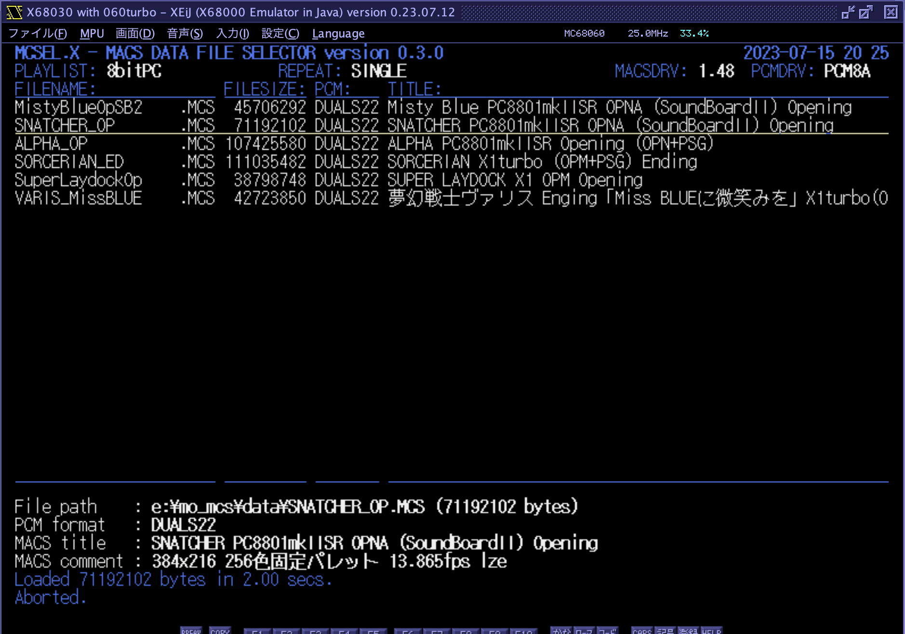
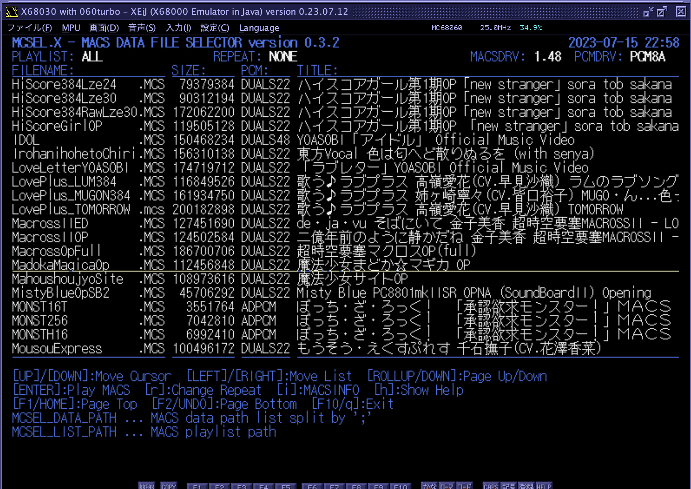

# MCSEL.X

MACS Data File Selector for Human68k/X680x0

---

## About This

MACSデータファイルのセレクタ兼ローダです。「まくせる」と読みます（ぉ

 - ハイメモリ専用
 - ディスクからハイメモリに高速ダイレクトロード
 - PhantomX VDISK対応
 - エミュレータのホストファイルシステム対応
 - プレイリスト対応
 - リピート再生対応

---

## 動作環境

実機の場合は PhantomX (68030以上) + ハイメモリ + VDISK、エミュレータの場合は 68030以上 + ハイメモリ + ホストファイルシステムを想定しています。
ハイメモリの無い68000機やSASI/SCSIディスクでの動作は想定していません。

---

#### ハイメモリ

060turbo方式のハイメモリ(最低128MB程度、できれば384MB)が必須となりますので、以下のいずれかのハイメモリドライバが必要です。

1. 060turbo.sys

68060の場合はOSに対するパッチ等の理由からこちらをお勧めします。拡張モード(`-xm`)である必要はありませんが、`-ss`と`-dv`はつけたほうが良いでしょう。

2. TS16DRVp.X

68030の場合はこちらをお勧めします。特にオプションなどの指定はありません。

ハイメモリドライバが組み込まれていない場合は起動エラーとなります。

---

#### PCMドライバ

PCMドライバとして、PCM8A.X (256MB以上ハイメモリ対応版) または PCM8PP.X が必須です。
いずれも組み込まれていない場合は起動エラーとなります。

PCM8A.X の256MBハイメモリ対応改造版は以下のTcbnErik氏のGithubから入手できます。

[PCM8A.X 改造版](https://github.com/kg68k/pcm8a)

---

#### MACSドライバ

ハイメモリに対応した MACSDRV.X が組み込まれている必要があります。
また、必須ではありませんが MACSINFO.X をパスの通った場所に導入しておくことを推奨します。

---

#### SCSIドライバ

どうしてもSCSIディスクから読み込みしたい場合は TS16FILE.X を組み込んでおく必要があります。

---

## インストール

MCSELxxx.ZIP をダウンロードして、MCSEL.X をパスの通ったディレクトリにコピーします。

以下の2つの環境変数を設定しておきます。

- MCSEL_DATA_PATH ... MACSデータファイル(*.MCS)を格納してあるディレクトリ名をセミコロン(;)で区切って連結したもの。

- MCSEL_LIST_PATH ... MACSプレイリストファイル(*.MCL)を格納してあるディレクトリ名。1つだけ指定可能。

例：

    SET MCSEL_DATA_PATH=G:\MCS_DATA;H:\MCS_DATA;I:\MCS_DATA;J:\MCS_DATA;K:\MCS_DATA
    SET MCSEL_LIST_PATH=D:\MCS_LIST

#### MACSプレイリストファイル(*.MCL)

単にMCSファイルのフルパス名を1行に1つずつ記述したテキストファイルです。
テキストエディタで作成してください。ファイル名がプレイリスト名として扱われます。

なお、プレイリストのファイルの並びはMCLファイルに記述した通りとなります。
全データ表示(プレイリスト名:ALL)の場合はファイル名の辞書順にソートされます。

---

## 利用方法

必要なドライバと環境変数を設定した上で、

    mcsel

で起動します。条件に不足があった場合は起動エラーとなりますのでメッセージを確認してください。

コマンドラインオプションもいくつかありますが、詳細は `-h` をつけて実行すると表示されるヘルプを参照してください。

起動直後の画面は上記のようになります。

1行目 ... アプリケーションのバージョン、PhantomXの場合はSoC温度、日付と時刻
2行目 ... 現在選択されているプレイリスト名、現在のリピートモード、MACSDRVのバージョン、PCMドライバの種類
4行目以降 ... MCSファイルのリスト
下段部 ... 操作説明

起動直後はプレイリスト"ALL"となっています。これは`MCSEL_DATA_PATH`で指定したディレクトリ全体からスキャンしたすべてのMCSファイルがリストされます。
プレイリストはカーソルの左右で切り替えが可能です。

カーソルバーはカーソルの上下で動かせます。その他ページ送りやリスト先頭・末尾へのジャンプなどもありますのでヘルプメッセージを参照してください。
なお、ヘルプに書かれていませんが、emacsキーバインドおよびviキーバインドの一部も対応しています。

リターンキーを押すと選択されているMACSデータを再生します。ロード中にESCを押すとキャンセル可能です。

---

`r`キーを押すとリピートモードを切り替えることができます。NONE(リピートなし) -> ALBUM(リスト全体を順番に再生) -> SHUFFLE(リスト全体をランダムに再生) -> SINGLE(カーソル位置の曲を無限ループ再生) -> SINGLE2(カーソル位置の曲を2回再生) -> SINGLE3(カーソル位置の曲を3回再生) -> NONE が押すたびに切り替わります。

`i`キーを押すとmacsinfoの結果を下段部に表示します。行数の関係で一部見切れます。

`h`キーを押すと起動直後に表示されるものと同じ操作方法のヘルプを下段部に表示します。

`ESC`キー、`q`キー、F10キーのいずれかで終了します。

---

## Special Thanks

以下のMACSプレーヤの仕様および実装を参考にさせて頂きました。この場を借りてお礼申し上げます。

- MACSplay.x (カタさん)
- MCSP.X (みゆ🌹ฅ^•ω•^ฅ さん)

---

## History

* 0.4.0 (2023/07/16) ... 初版
